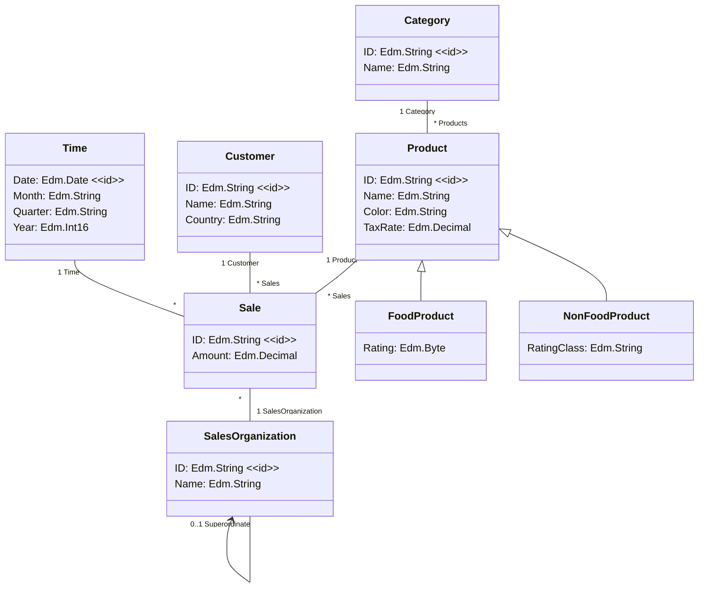

# Experiments with Mermaid diagrams and MathJax formulas

Github Enterprise 3.7 supports Mermaid diagrams, see [Creating Diagrams](https://docs.github.com/en/enterprise-server@3.7/get-started/writing-on-github/working-with-advanced-formatting/creating-diagrams).

Use the [Markdown Preview Mermaid Support](https://marketplace.visualstudio.com/items?itemName=bierner.markdown-mermaid) VS Code extension for creating these diagrams.

## Example

A simple class diagram:

Here is a simple flow chart:

This results in a runtime of 

$$t_\text{total} = t_A+\max(t_B,t_C) + t_D$$

with $t_x$ the runtime of step $x \in \\{ A,B,C,D \\}$.

## Instructions

Mermaid and MathJax are now natively supported when viewing `.md` files on GitHub. However, they are not automatically supported in [GitHub Pages](https://ralfhandl.github.io/mermaid-diagrams/). 

To enable MathJax in GitHub Pages, see [this stack overflow answer](https://stackoverflow.com/a/72931039).

To enable Mermaid in GitHub Pages, see [this stack overflow answer](https://stackoverflow.com/a/53893998).

Both solutions are applied in [_layouts/default.html](https://github.com/ralfhandl/mermaid-diagrams/blob/main/_layouts/default.html).
